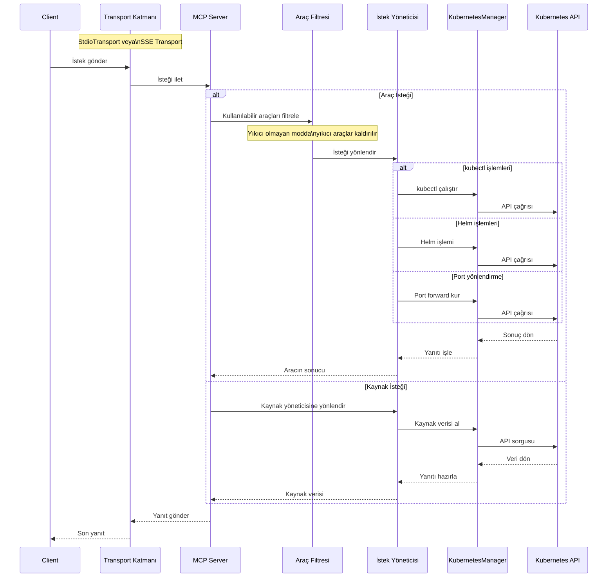

# MCP Server Kubernetes

[](https://github.com/Flux159/mcp-server-kubernetes/actions/workflows/ci.yml)
[](https://github.com/Flux159/mcp-server-kubernetes)
[](https://bun.sh)
[](https://kubernetes.io/)
[](https://www.docker.com/)
[](https://github.com/Flux159/mcp-server-kubernetes/stargazers)
[](https://github.com/Flux159/mcp-server-kubernetes/issues)
[](https://github.com/Flux159/mcp-server-kubernetes/pulls)
[](https://github.com/Flux159/mcp-server-kubernetes/commits/main)
[](https://smithery.ai/protocol/mcp-server-kubernetes)

Kubernetes kümeleriyle iletişim kuran ve onları yöneten bir MCP sunucusu. Kubeconfig dosyasını birden fazla kaynaktan öncelik sırasına göre yükleyebilir.


<a href="https://glama.ai/mcp/servers/w71ieamqrt"></a>

## n8n ile Kullanım

Sunucuyu SSE taşımacılığı aktif şekilde başlatıp n8n içindeki HTTP Request düğümleri ile iletişim kurabilirsiniz. Sunucuyu çalıştırın:

## Usage with n8n

You can run the server with the SSE transport enabled and interact with it from
n8n using HTTP Request nodes. Start the server:

```bash
ENABLE_UNSAFE_SSE_TRANSPORT=1 PORT=3001 npx mcp-server-kubernetes
```

Ardından `/sse` uç noktasından oturum kimliğini aldıktan sonra n8n içinden `http://localhost:3001/messages?sessionId=<sessionId>` adresine JSON-RPC istekleri gönderebilirsiniz. Basit bir örnek için `src/n8n-client.ts` dosyasına bakın. İsterseniz `workflows/mcp-kubernetes-example.n8n.json` dosyasını n8n'e içe aktararak hazır bir akışla da deneyebilirsiniz.
Then use an HTTP Request node in n8n to POST JSON-RPC messages to
`http://localhost:3001/messages?sessionId=<sessionId>` after retrieving the
session ID from the `/sse` endpoint. See `src/n8n-client.ts` for a minimal
example script. You can also import `workflows/mcp-kubernetes-example.n8n.json`
into n8n for a ready-to-run workflow.

By default, the server loads kubeconfig from `~/.kube/config`. For additional authentication options (environment variables, custom paths, etc.), see [ADVANCED_README.md](ADVANCED_README.md).

Varsayılan olarak kubeconfig `~/.kube/config` yolundan okunur. Diğer kimlik doğrulama seçenekleri için [ADVANCED_README.md](ADVANCED_README.md) dosyasına bakabilirsiniz.

Sunucu mevcut kubectl bağlamınızı otomatik olarak kullanır. Şunların kurulu olduğundan emin olun:

1. kubectl PATH değişkeninde olmalı
2. Geçerli bağlamlara sahip bir kubeconfig dosyası
3. minikube, Rancher Desktop veya GKE gibi bir Kubernetes kümesine erişim
4. Helm v3 (isteğe bağlı)
You can verify your connection by listing pods or creating a test deployment using the provided tools.

Bağlantınızı, sağlanan araçlarla podları listeleyerek veya örnek bir dağıtım oluşturarak doğrulayabilirsiniz.

Sorun yaşarsanız standart bir terminalde `kubectl get pods` çalıştırarak erişiminizi kontrol edin.

## mcp-chat ile Kullanım

[Konsol tabanlı mcp-chat](https://github.com/Flux159/mcp-chat) aracı ile bu sunucuya bağlanabilirsiniz.

```shell
npx mcp-chat --server "npx mcp-server-kubernetes"
```

## Docker ile Çalıştırma

Projeyi Docker üzerinde çalıştırmak için `docker-compose.yml` dosyasını kullanabilirsiniz. Kurulum için:

```bash
docker compose up --build
```

Bu işlem Dockerfile üzerinden imajı oluşturur. SSE taşımacılığı varsayılan olarak etkindir ve konteyner 3001 portunu dinler. Kendi `~/.kube/config` dosyanız konteynere salt-okunur olarak bağlanır. Gerekirse `docker-compose.yml` içindeki ortam değişkenleriyle portu değiştirebilirsiniz.

## Özellikler

- [x] Kubernetes kümesine bağlanma
- [x] Kaynak yönetimi için birleşik kubectl API'si
  - `kubectl_get` ile kaynakları listeleme
  - `kubectl_describe` ile kaynak ayrıntıları
  - `kubectl_create` ile kaynak oluşturma
  - `kubectl_apply` ile YAML manifestleri uygulama
  - `kubectl_delete` ile kaynak silme
  - `kubectl_logs` ile log görüntüleme
  - `kubectl_context` ile bağlam yönetimi
  - `explain_resource` ile kaynak açıklamaları
  - `list_api_resources` ile API kaynaklarını listeleme
  - `kubectl_scale` ile ölçeklendirme
  - `kubectl_patch` ile alan güncelleme
  - `kubectl_rollout` ile dağıtım yönetimi
  - `kubectl_generic` ile herhangi bir kubectl komutu
  - `ping` ile bağlantı doğrulama
- [x] İleri seviye işlemler
  - `port_forward` ile port yönlendirme
  - Helm chart kurulum, güncelleme ve kaldırma
- [x] `k8s-diagnose` sorun giderme istemi
- [x] Sadece okuma ve güncelleme yetkisi veren yıkıcı olmayan mod

## İstemler

Sunucu, sık karşılaşılan teşhis işlemleri için özel istemler içerir.

### k8s-diagnose İstemi

Bu istem belirli bir anahtar kelime ve isteğe bağlı ad alanı alarak pod sorunlarını sistematik şekilde inceleyen bir akış sunar.

## Yerel Geliştirme

[bun kurulu](https://bun.sh/docs/installation) olduğundan emin olun. Depoyu klonlayıp bağımlılıkları yükleyin:

```bash
git clone https://github.com/Flux159/mcp-server-kubernetes.git
cd mcp-server-kubernetes
bun install
```

### Geliştirme Adımları

1. Dosya değişikliklerini izleyerek sunucuyu başlatın:

```bash
bun run dev
```

2. Birim testlerini çalıştırın:

```bash
bun run test
```

3. Projeyi derleyin:

```bash
bun run build
```

4. [Inspector](https://github.com/modelcontextprotocol/inspector) ile yerel test:

```bash
npx @modelcontextprotocol/inspector node dist/index.js
# Terminalde verilen bağlantıyı takip edin
```

5. n8n istemci örneğiyle test:


```bash
node ./dist/n8n-client.js
```

6. [mcp-chat](https://github.com/Flux159/mcp-chat) ile test:

```bash
bun run chat
```

## Katkıda Bulunma

Ayrıntılar için [CONTRIBUTING.md](CONTRIBUTING.md) dosyasına bakın.

## Gelişmiş

### Yıkıcı Olmayan Mod

Tüm yıkıcı işlemleri devre dışı bırakmak için sunucuyu şu şekilde çalıştırabilirsiniz:

```shell
ALLOW_ONLY_NON_DESTRUCTIVE_TOOLS=true npx mcp-server-kubernetes
```


n8n üzerinde de aynı değişkeni kullanarak sunucuyu çalıştırabilirsiniz:
To run n8n in a non-destructive configuration, set the environment variable when starting the server:

```bash
ALLOW_ONLY_NON_DESTRUCTIVE_TOOLS=true ENABLE_UNSAFE_SSE_TRANSPORT=1 PORT=3001 npx mcp-server-kubernetes
```

### Commands Available in Non-Destructive Mode


```bash
ALLOW_ONLY_NON_DESTRUCTIVE_TOOLS=true ENABLE_UNSAFE_SSE_TRANSPORT=1 PORT=3001 npx mcp-server-kubernetes
```

### Yıkıcı Olmayan Modda Kullanılabilen Komutlar

- `kubectl_get`, `kubectl_describe`, `kubectl_logs`, `explain_resource`, `list_api_resources`
- `kubectl_apply`, `kubectl_create`, `kubectl_scale`, `kubectl_patch`, `kubectl_rollout`
- `install_helm_chart`, `upgrade_helm_chart`
- `port_forward`, `stop_port_forward`
- `kubectl_context`

### Devre Dışı Komutlar

- `kubectl_delete`
- `uninstall_helm_chart`
- `cleanup`
- `kubectl_generic`

Diğer gelişmiş özellikler için [ADVANCED_README.md](ADVANCED_README.md) (İngilizce) dosyasına göz atabilirsiniz.

## Mimarî

Yüksek seviyede mimarî akış aşağıdaki gibidir:



Daha ayrıntılı mimarî için [DeepWiki](https://deepwiki.com/Flux159/mcp-server-kubernetes) sayfasına bakabilirsiniz.

## Yeni Sürüm Yayınlama

[Releases](https://github.com/Flux159/mcp-server-kubernetes/releases) sayfasına gidip "Draft New Release" seçeneği ile `v{major}.{minor}.{patch}` formatında yeni bir etiket oluşturun. Başlık olarak "Release v{major}.{minor}.{patch}" yazıp gerekli değişiklikleri ekleyin ve "Publish Release" butonuna tıklayın.

Bu işlem cd.yml iş akışını tetikler ve yeni sürüm npm üzerinde yayınlanır. `package.json` sürümü otomatik güncellendiği için elle değiştirmeye gerek yoktur.

## Planlanmayanlar

kubectx'e yeni kümeler eklemek.
